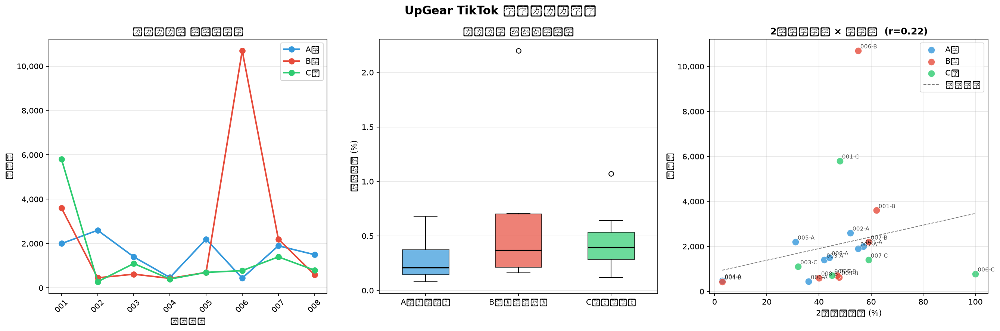

# UpGear TikTok 投稿データ分析レポート

**集計投稿数**: 24 本　**総再生数**: 43,075　**平均いいね率**: 0.45%

---

## 1. 基本集計

### 1-1. シリーズ別平均

| シリーズ | 投稿数 | 再生数_平均 | 再生数_合計 | いいね_平均 | いいね率_平均 | 維持率_平均 | 最終到達率_平均 |
|---|---|---|---|---|---|---|---|
| 001 | 3 | 3800.0 | 11400 | 9.3 | 0.2 | 55.7 | 27.0 |
| 002 | 3 | 1111.7 | 3335 | 5.0 | 1.1 | 52.0 | 27.0 |
| 003 | 3 | 1040.0 | 3120 | 2.7 | 0.2 | 40.6 | 15.0 |
| 004 | 3 | 433.3 | 1300 | 2.0 | 0.5 | 3.0 | 3.0 |
| 005 | 3 | 1200.0 | 3600 | 5.3 | 0.5 | 41.0 | 15.7 |
| 006 | 3 | 3973.3 | 11920 | 10.7 | 0.5 | 63.7 | 16.0 |
| 007 | 3 | 1833.3 | 5500 | 5.3 | 0.3 | 57.7 | 31.3 |
| 008 | 3 | 966.7 | 2900 | 2.0 | 0.2 | 42.0 | 15.0 |

### 1-2. 構成タイプ別（A/B/C）平均

| タイプ | 投稿数 | 再生数_平均 | いいね率_平均 | 維持率_平均 | 最終到達率_平均 | 保存_合計 | フォロー増_合計 |
|---|---|---|---|---|---|---|---|
| A | 8 | 1563.8 | 0.3 | 40.0 | 18.4 | 2 | 4 |
| B | 8 | 2413.1 | 0.6 | 44.8 | 21.0 | 4 | 7 |
| C | 8 | 1407.5 | 0.5 | 56.8 | 16.8 | 5 | 2 |

### 1-3. いいね率ランキング

**上位5本**

| No | 再生数 | いいね率 | フック |
|---|---|---|---|
| 002-B | 455 | 2.2 | 無印リュックを買わなくていい人 |
| 002-C | 280 | 1.07 | 3990円と38500円どちらを買うべきか |
| 005-B | 700 | 0.71 | サロモンを買う前に確認してほしいことがある　俺は革靴から乗り換えた |
| 004-B | 430 | 0.7 | 毎年夏にTシャツで5分以上迷った子rとがある人へ　その迷いが終わらない理由がある |
| 006-A | 440 | 0.68 | 会社のマウスを急に動かせなくなった　マウスを変えて1か月後の話 |

**下位5本**

| No | 再生数 | いいね率 | フック |
|---|---|---|---|
| 003-B | 620 | 0.16 | \37000の靴を買って後悔する人の特徴 |
| 001-A | 2000 | 0.15 | デスクが狭いと感じたことがある人へ |
| 008-A | 1500 | 0.13 | イヤホンをまだ選んでいるか　1年前に考えるのを辞めた |
| 008-C | 800 | 0.12 | 満員電車を自分の部屋にする前に３つ確認しろ |
| 002-A | 2600 | 0.08 | 通勤バックに3万円出す前に見て |

---

## 2. フック分析

### 2-1. 再生数上位5本のフック

| No | 再生数 | いいね率 | フック |
|---|---|---|---|
| 006-B | 10700 | 0.22 | 普通のマウスをまだ使う理由があるか　俺は1年前に捨てた |
| 001-C | 5800 | 0.31 | 普通のマウスをやめるために確認すること |
| 001-B | 3600 | 0.19 | なぜトラックボールは満点じゃなかったのか |
| 002-A | 2600 | 0.08 | 通勤バックに3万円出す前に見て |
| 005-A | 2200 | 0.36 | 俺が仕事用の靴にトレランシューズを選んだ理由　見た目で選んで機能で確信した |

### 2-2. 再生数下位5本のフック

| No | 再生数 | いいね率 | フック |
|---|---|---|---|
| 002-B | 455 | 2.2 | 無印リュックを買わなくていい人 |
| 006-A | 440 | 0.68 | 会社のマウスを急に動かせなくなった　マウスを変えて1か月後の話 |
| 004-B | 430 | 0.7 | 毎年夏にTシャツで5分以上迷った子rとがある人へ　その迷いが終わらない理由がある |
| 004-C | 400 | 0.5 | エアリズムを買う前に確認すること3つ　買った後に後悔しないために |
| 002-C | 280 | 1.07 | 3990円と38500円どちらを買うべきか |

### 2-3. いいね率上位5本のフック

| No | 再生数 | いいね率 | フック |
|---|---|---|---|
| 002-B | 455 | 2.2 | 無印リュックを買わなくていい人 |
| 002-C | 280 | 1.07 | 3990円と38500円どちらを買うべきか |
| 005-B | 700 | 0.71 | サロモンを買う前に確認してほしいことがある　俺は革靴から乗り換えた |
| 004-B | 430 | 0.7 | 毎年夏にTシャツで5分以上迷った子rとがある人へ　その迷いが終わらない理由がある |
| 006-A | 440 | 0.68 | 会社のマウスを急に動かせなくなった　マウスを変えて1か月後の話 |

### 2-4. フック頻出キーワード（上位20語）

| キーワード | 出現回数 |
|---|---|
| デスクが狭いと感じたことがある人へ | 1 |
| なぜトラックボールは満点じゃなかったのか | 1 |
| 普通のマウスをやめるために確認すること | 1 |
| 通勤バックに3万円出す前に見て | 1 |
| 無印リュックを買わなくていい人 | 1 |
| 3990円と38500円どちらを買うべきか | 1 |
| なぜ９９０V4は85点止まりなのか | 1 |
| \37000の靴を買って後悔する人の特徴 | 1 |
| 990V4を買う前に確認すること | 1 |
| エアリズムを選ぶ気持ちは「わかる」でも装備じゃない | 1 |
| その理由を説明する | 1 |
| 毎年夏にTシャツで5分以上迷った子rとがある人へ | 1 |
| その迷いが終わらない理由がある | 1 |
| エアリズムを買う前に確認すること3つ | 1 |
| 買った後に後悔しないために | 1 |
| 俺が仕事用の靴にトレランシューズを選んだ理由 | 1 |
| 見た目で選んで機能で確信した | 1 |
| サロモンを買う前に確認してほしいことがある | 1 |
| 俺は革靴から乗り換えた | 1 |
| サロモンを買う前に3つだけ確認しろ | 1 |

---

## 3. 維持率分析

- **2枚目維持率 × 再生数** 相関係数: **r = 0.223**

- **最終到達率 × 保存数** 相関係数: **r = 0.425**

### 維持率が高い投稿（中央値以上）

| No | 再生数 | いいね率 | 2枚目維持率 | 最終到達率 | フック |
|---|---|---|---|---|---|
| 001-A | 2000 | 0.15 | 56.99999999999999 | 28.999999999999996 | デスクが狭いと感じたことがある人へ |
| 001-B | 3600 | 0.19 | 62.0 | 28.999999999999996 | なぜトラックボールは満点じゃなかったのか |
| 001-C | 5800 | 0.31 | 48.0 | 23.0 | 普通のマウスをやめるために確認すること |
| 002-A | 2600 | 0.08 | 52.0 | 27.0 | 通勤バックに3万円出す前に見て |
| 003-B | 620 | 0.16 | 47.8 | 19.0 | \37000の靴を買って後悔する人の特徴 |
| 006-B | 10700 | 0.22 | 55.00000000000001 | 33.0 | 普通のマウスをまだ使う理由があるか　俺は1年前に捨てた |
| 006-C | 780 | 0.64 | 100.0 | 0.0 | マウスを買う前に3つだけ確認しろ買う前に知りたかった事だ |
| 007-A | 1900 | 0.42 | 55.00000000000001 | 28.999999999999996 | 通勤バッグを値段で選んでいいのか　俺は1年使ってる |

---

## 4. 次シリーズへの推奨

### 4-1. 商品ジャンル別パフォーマンス

| 商品 | 投稿数 | 再生数_平均 | いいね率_平均 | 維持率_平均 |
|---|---|---|---|---|
| ELECOM　　　　　M-IT10BRBK | 3 | 3973.3 | 0.5 | 63.7 |
| トラックボール | 3 | 3800.0 | 0.2 | 55.7 |
| 無印 撥水リュック | 3 | 1833.3 | 0.3 | 57.7 |
| Salomon XAPROGTX | 3 | 1200.0 | 0.5 | 41.0 |
| 無印 リュック | 3 | 1111.7 | 1.1 | 52.0 |
| NB990V4  | 3 | 1040.0 | 0.2 | 40.6 |
| Technics　EAHーAZ40M2  | 3 | 966.7 | 0.2 | 42.0 |
| ユニクロ エアリズム | 3 | 433.3 | 0.5 | 3.0 |

### 4-2. B型フック成功パターン

| No | 再生数 | いいね率 | 2枚目維持率 | フォロー増 | フック |
|---|---|---|---|---|---|
| 006-B | 10700 | 0.22 | 55.00000000000001 | 3 | 普通のマウスをまだ使う理由があるか　俺は1年前に捨てた |
| 001-B | 3600 | 0.19 | 62.0 | 2 | なぜトラックボールは満点じゃなかったのか |
| 007-B | 2200 | 0.23 | 59.0 | 1 | 通勤バッグをまだ選んでいるか　1年前に考えるのをやめた |
| 005-B | 700 | 0.71 | 47.0 | 1 | サロモンを買う前に確認してほしいことがある　俺は革靴から乗り換えた |
| 003-B | 620 | 0.16 | 47.8 | 0 | \37000の靴を買って後悔する人の特徴 |
| 008-B | 600 | 0.5 | 40.0 | 0 | 満員電車でひとりになれるか　俺はイヤホンで答えが出た |
| 002-B | 455 | 2.2 | nan | 0 | 無印リュックを買わなくていい人 |
| 004-B | 430 | 0.7 | 3.0 | 0 | 毎年夏にTシャツで5分以上迷った子rとがある人へ　その迷いが終わらない理由がある |

### 4-3. 009以降 集約型設計フック候補（3案）

1. 【逆張り×一人称】俺が〇〇を仕事で使うのをやめた理由／1年前に決断した
2. 【006-B型転用】普通のマウスをまだ使う理由があるか｜（009商品名に差し替え）
3. 【ギャップ型】〇〇に△△円出す前に見ておけ／買って気づいた唯一の後悔

> **設計原則（確定）**
> - B型×一人称×逆張りフックが最高再生パターン（006-B: 10,700再生）
> - 「まだ〇〇しているか」＋「俺は1年前に〜した」の2文構成が有効
> - 商品名は4〜5枚目まで伏せる
> - アイテムの当事者の広さ（全デスクワーカー vs 通勤者）が再生数の天井を決める

---

## 5. グラフ

---

*生成日時: 2026-06-26 03:36*
